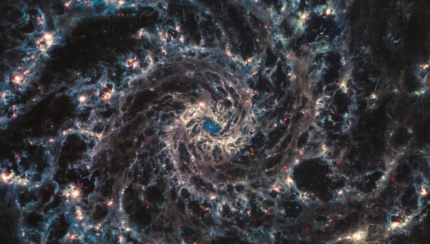

# Summer school

This github repository is for the N-body cosmological simulations session of the Precise Summer School in Warsaw. Each of the three sessions have their own directory (Session 1, 2 and 3), each with a jupyter notebook that should be used for the interactive part of each session. Each jupyter notebook contains all of the necessary information and instructions for the given session.

## Installation and requirements

### Python

The sessions require the use of jupyter notebooks. As such, you need to have Python3 installed, along with a number of Python packages. You will need:

- Python3.8 (or higher)

A full list of the required Python packages can be found in the file `requirements.txt`. These can automatically be installed with the following command,

`python3 -m pip install --requirement=requirements.txt [--user]`

The `--user` flag may be required if you are using a managed machine and do not have admin privileges. Other Python package managers, such as anaconda can also be used.

### SWIFT (optional)

Those wanting to run the simulations themselves will need to download and compile [SWIFT](https://swift.dur.ac.uk/docs/index.html), see their website for details. For those who only want to analyse the simulations we have the preran simulations for each session in the `./Simulations` directory, and you can simply skip the 'run the simulation' sections in the jupyter notebooks. You will also need to edit the file locations to point these simulations where needed.

SWIFT is written C99 and requires the following C packages that will need to be installed (ask use if you have issues):

- OpenMPI
- Libtool
- GSL
- FFTW (3.3.x or higher)
- HDF5

It is likely that a number of these will already be installed. HDF5, FFTW and Libtool are the most likely you will need to install by hand. 

#### Linux:

On an ubuntu style system (using debian) these can be installed with the commands:
```
[sudo] apt-get install fftw3-dev
[sudo] apt-get install libhdf5-dev
```
etc.

Or alternatively these can be compiled yourself. See [HDF5](https://www.hdfgroup.org/downloads/hdf5/) and [FFTW](https://www.fftw.org/download.html).

#### OS X:

We recommend using the [Homebrew](https://brew.sh/) package manager if you don't already have it.
```
/bin/bash -c "$(curl -fsSL https://raw.githubusercontent.com/Homebrew/install/HEAD/install.sh)"
```

You can then install the packages using the following command

```
brew install [package name]
```
e.g.
```
brew install gsl
brew install fftw
```
etc

## Downloading simulations

There are a number of larger simulations that are used in Session 3. Depending on the time and disk space available you can either download all of the simulations of only the DM only ones.

For all simulations (~ 16 Gb) you can download them with the following commands
```
wget -c https://virgodb.cosma.dur.ac.uk/public/dc-brow5/Summer_school/simulations/All_simulations.tar.gz
tar -xzvf All_simulations.tar.gz
```

Alternatively, if you only want to download the DM only simulations (~ 5 Gb) then do the following
```
wget -c https://virgodb.cosma.dur.ac.uk/public/dc-brow5/Summer_school/simulations/DMONLY_simulations.tar.gz
tar -xzvf DMONLY_simulations.tar.gz
```


